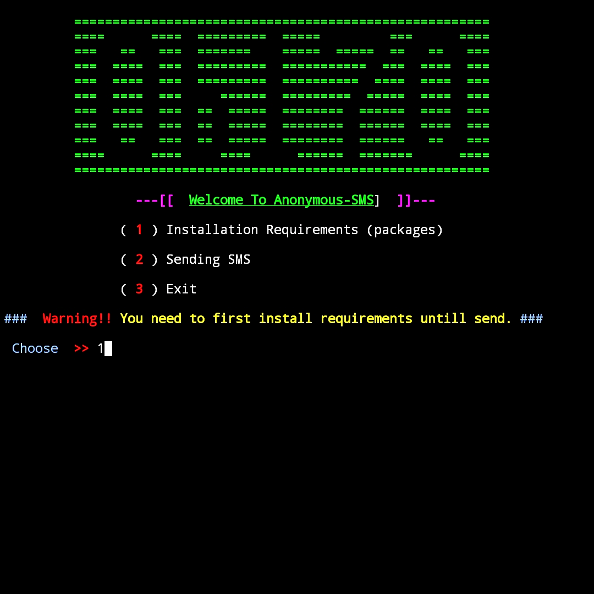
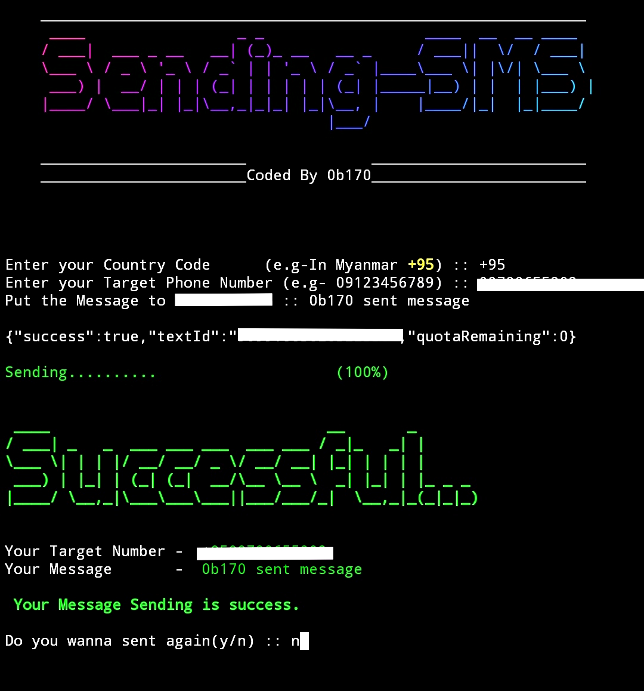

# Sending SMS Message Anonymously

If you put correctly information,it works.

But there is limited that a chance to send message for a phone in one day.
## Installation
### Pre-Installation
* pkg update && pkg upgrade -y
* pkg install git -y
* git clone https://github.com/Nay-Htet007/Anonymous-SMS
* cd Anonymous-SMS
* chmod +x run.sh
* ./run.sh

### Installing Requirement Packages

Select No.1 to install Requirements

### Sending-SMS

First Put Country Code

(e.g- In Myanmar +95)

Second is Your Target Phone Number - 09xxxxxxxxx

Third is what you wanna message - Hello

